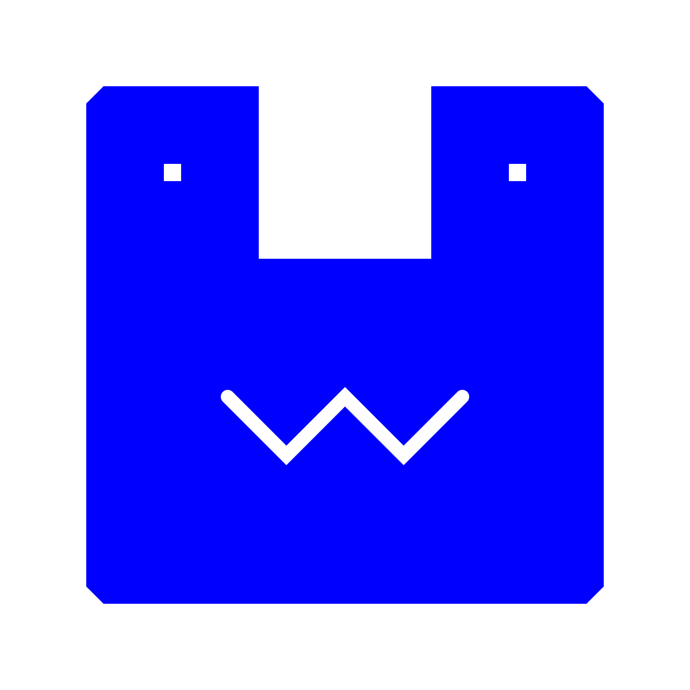
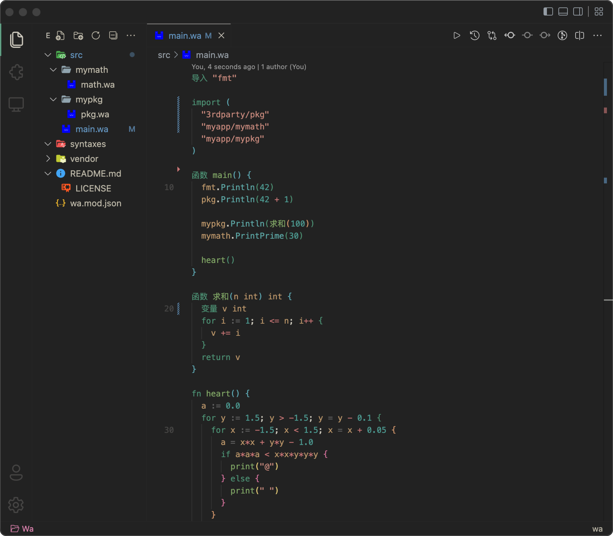

<sub><em>Wa Lang for VS Code</em></sub>
<h1 align="center">
  
</h1>

凹语言™ 的 VS Code 插件

## Preview



## Features

`mac` 用户需要 `vscode/settings.json` 中配置 `rootPath`，即 wa 的程序地址

```json
{
  "wa.rootPath": "/Users/xxx/go/bin/wa"
}
```


- 语法高亮（web 插件已支持）
- 内置代码片段（web 插件已支持）
- wasm语法高亮（web 插件已支持）
- 自动格式化
- Run Code 命令
