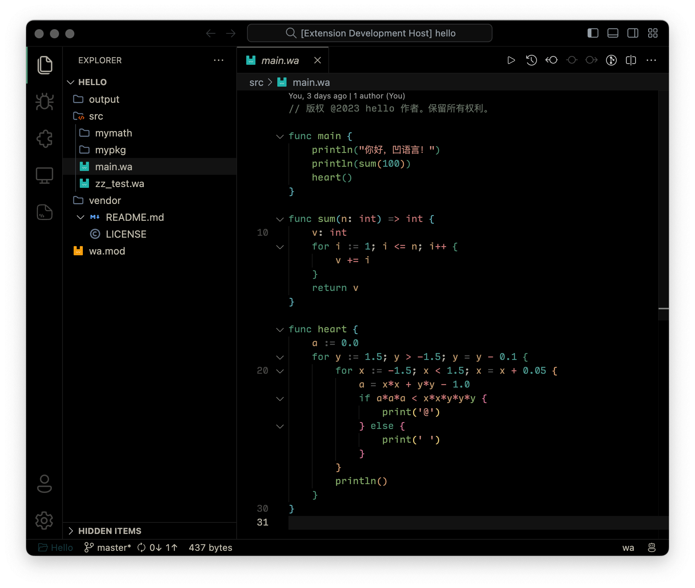

<em>Wa Lang for VS Code</em>
<h1 align="center">
  
</h1>

凹语言™ 的 VS Code 插件

## Preview

## Features

确保已经安装了 [凹语言](https://wa-lang.org/man/chs/1.%E5%AE%89%E8%A3%85%E5%8F%8A%E5%85%A5%E9%97%A8/1.2.%E5%AE%89%E8%A3%85%E5%87%B9%E8%AF%AD%E8%A8%80.html)， `macOS` 和 `Linux` 系统建议使用 `Homebrew` 进行安装。

- 语法高亮（web 插件已支持）
- 内置代码片段（web 插件已支持）
- wasm语法高亮（web 插件已支持）
- 自动格式化
- Run Code 命令
